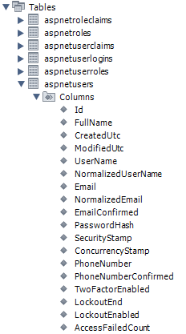

Reusable codes for JWT security in business applications; decouple authorization and database engine from the main API functions.

# Introduction
If you’ve decided to host your own authentication mechanism in your ASP.NET Core applications, there are numerous helpful articles demonstrating how to use ASP.NET Core Identity, OAuth, and JWT tokens. For the purposes of this article, I assume you have some experience with ASP.NET Core Identity. Our focus here is on decoupling ASP.NET Core Identity, authentication, and database engines.

If you are not familiar with OAuth or JWT, the integration test suites included in the GitHub repository showcase common authentication conversations using OAuth.

While this article won’t cover every aspect or level of security concerns for building complex business applications, the tips provided are based on specific presumptions and contexts:

1. You are building a green field project.
1. The authentication mechanism from the green field project will be shared by other business applications to be used in the future.
1. Some of the applications will be utilizing oAuth2 with Google, Microsoft, Apple and Facebook etc., as well as other propriety authentications.
1. Some applications support Push, and the implementation is SignalR.
1. The preferred ID type for entities including user entity is GUID rather than string. 
1. Entity Framework Core is used for building DAL.
1. The application is neutral to database engines. That is, you may switch to MySQL, SQLite, MS SQL and Oracle etc. easily.
1. You want the same user John Smith to keep login on multiple devices, and each device has multiple apps or multiple browser tabs.
1. While the specific requirements of ASP.NET applications can vary widely, the fundamental concepts discussed in the following code examples can serve as alternative solutions.

**References**

* [Identity model customization](https://web.archive.org/web/20240821233255/http://learn.microsoft.com/en-us/aspnet/core/security/authentication/customize-identity-model) in [ASP.NET Core Identity](https://web.archive.org/web/20240821233255/https://learn.microsoft.com/en-us/aspnet/core/security/authentication/identity) with support for [external login 
providers includes Google, Microsoft Account and Facebook etc. using OAuth 2.0](https://web.archive.org/web/20240821233255/https://learn.microsoft.com/en-us/aspnet/core/security/authentication/social).
* [Implementing Multiple Identities in your .NET Core Web App](https://web.archive.org/web/20240821233255/https://techcommunity.microsoft.com/t5/microsoft-developer-community/implementing-multiple-identities-in-your-net-core-web-app-part-1/ba-p/337482)
* [Custom storage providers for ASP.NET Core Identity](https://web.archive.org/web/20240821233255/https://learn.microsoft.com/en-us/aspnet/core/security/authentication/identity-custom-storage-providers)


# Background

If you have never used  [ASP.NET Identity](https://web.archive.org/web/20240821233255/https://learn.microsoft.com/en-us/aspnet/identity/overview/getting-started/introduction-to-aspnet-identity) before ASP.NET Core, you may skip this Background section about what available in .NET Framework.

Visual Studio with .NET Framework had provided fairly easy starting point for inexperienced Web app developers. When you create a new ASP.NET MVC project, you will have such structure with scaffolding codes:


Web.config:

```xml
<configuration>
  <configSections>
    <!-- For more information on Entity Framework configuration, visit http://go.microsoft.com/fwlink/?LinkID=237468 -->
    <section name="entityFramework" type="System.Data.Entity.Internal.ConfigFile.EntityFrameworkSection, EntityFramework, Version=6.0.0.0, Culture=neutral, PublicKeyToken=b77a5c561934e089" requirePermission="false" />
  </configSections>
  <connectionStrings>
    <add name="DefaultConnection" connectionString="Data Source=(LocalDb)\MSSQLLocalDB;AttachDbFilename=|DataDirectory|\aspnet-WebApplication1-20240328045515.mdf;Initial Catalog=aspnet-WebApplication1-20240328045515;Integrated Security=True"
      providerName="System.Data.SqlClient" />
  </connectionStrings>
  
  ....
  
   <entityFramework>
    <providers>
      <provider invariantName="System.Data.SqlClient" type="System.Data.Entity.SqlServer.SqlProviderServices, EntityFramework.SqlServer" />
    </providers>
  </entityFramework>
...
```

And you can switch to the other DB engine after the build or the deployment, since the runtime will read the config for connection strings and EF providers during the app start-up.

For enterprise applications, such prescribed structure may have a few major pitfalls:

* Not easy for unit testing and integration testing. And you would probably move what in folder "Models" and others to another package/assembly/csproj, for the sake of separation of concerns. God assembly is not wrong, just as god class is not wrong, however, unfriendly to TDD, thus unproductive for building enterprise applications.
* The SQL database requires a connection string that demands root or DBA role, not bad for a CMS app like Orchard and Umbraco, but for a common business application, not good.
* The whole architecture is optimized for / coupled with / biased toward MS SQL.
* ...

Since the popularity of [OAuth](https://web.archive.org/web/20240821233255/https://en.wikipedia.org/wiki/OAuth), over years when designing ASP.NET Core from scratch, Microsoft have become more friendly to database engines other then MS SQL, and utilizing [ASP.NET Core Identity](https://web.archive.org/web/20240821233255/https://learn.microsoft.com/en-us/aspnet/core/security/authentication/identity) and [Owin](https://web.archive.org/web/20240821233255/https://learn.microsoft.com/en-us/aspnet/core/fundamentals/owin) along with Entity Framework Core has become easier for application developers who may not have in-depth experiences in OAuth.

The scaffolding codes of a new ASP.NET Core project has less for authentication and account management, and this may be a good thing for enterprise applications, due to:

* There are more schemes of authentication, and 3rd party authorization providers like Auth0 and okta etc. And from time to time, you, the IT team or the security team may want to alter the mechanism of authentication and authorization, then surely you want the migration as smooth as possible. ASP.NET Core has provided fairly elegant architectural design for such needs.

# Using the Code

If you would host your own user identities and authorization, you would like to use what offered by classes in Microsoft.AspNetCore.Identity namespace and Microsoft.AspNetCore.Identity.EntityFrameworkCore namespace.

The code examples are focused on these subjects:

1. Change the ID type from string to GUID, and extend some DB tables with a few more columns.
1. Decouple the DB engine from the main application codes. That is, you can switch DB engine after deployment.
1. Integration test suite to verify if the authentication implemented is actually working.

## GUID as Identity ID
### Extension to Classes in Microsoft.AspNetCore.Identity Namespace

This is to have extensions to classes in Microsoft.AspNetCore.Identity namespace. 

The namespace contains generic classes like [IdentityRole<TKey>](https://web.archive.org/web/20240821233255/https://learn.microsoft.com/en-us/dotnet/api/microsoft.aspnetcore.identity.identityrole-1) and [IdentityUser<TKey>](https://web.archive.org/web/20240821233255/https://learn.microsoft.com/en-us/dotnet/api/microsoft.aspnetcore.identity.identityuser-1) with built-in concrete classes like [IdentityRole : IdentityRole<string>](https://web.archive.org/web/20240821233255/https://learn.microsoft.com/en-us/dotnet/api/microsoft.aspnetcore.identity.identityrole) and [IdentityUser : IdentityUser<string>](https://web.archive.org/web/20240821233255/https://learn.microsoft.com/en-us/dotnet/api/microsoft.aspnetcore.identity.identityuser) for identity models.

If you use the built-in concrete class IdentityRole or alike, the Id will be of type string with DB schema "VARCHAR(255)". Such DB schema is apparently a safe bet for most applications. However, if you are sure uuid / GUID is good enough regarding length and you prefer strongly typed ID like GUID, you may create a concrete class like:

```c#
public class ApplicationIdentityRole : IdentityRole<Guid>
{
    public ApplicationIdentityRole()
    {
        Id = Guid.NewGuid();
    }

    public ApplicationIdentityRole(string roleName) : this()
    {
        Name = roleName;
    }
}

public class ApplicationUser : IdentityUser<Guid>, ITrackableEntity
{
    /// <summary>
    /// Full name of the user. And this could be used as a filter or logical foreight key with a user.
    /// </summary>
    [MaxLength(128)]
    public string FullName { get; set; }

    public DateTime CreatedUtc { get; set; }

    public DateTime ModifiedUtc { get; set; }
}

public class ApplicationUserToken : IdentityUserToken<Guid>, INewEntity
{
    public DateTime CreatedUtc { get; set; }
}

public interface INewEntity{
    DateTime CreatedUtc { get; set; }
}
```

For the user profile, you may want to keep track of the date created and the date modified, along with the full name displayed.

**Hints**
* Even if you would just use IdentityRole : IdentityRole<string> and IdentityUser : IdentityUser<string> or their derived classes for identity models, the tips introduced in this article may inspire you for decoupled component design which is friendly to TDD and future expansion. Using string as the base type of ID would well take care of legacy or brown field projects which need to take care of legacy IDs and multiple schemes of unique IDs.
* A typical business application may have a small CRM that may include info of internal users and external users, and the full name in the user profile of the auth DB may be different from the one in the CRM.
* Even if it is easy to add many more columns to table "aspnetusers" through adding more properties to class "ApplicationUser", it is inflexible to store personal info of the user in this table, because:
* The properties for authentication rarely change over the product life cycle, while the * properties for personal info could change over time.
    * The update of personal info could be fairly frequent.
    * You want the auth DB run super fast, while the CURD of personal info could be relatively slower.
    * ...

### Extension to Classes in Microsoft.AspNetCore.Identity.EntityFrameworkCore Namespace

This namespace contains a few generic classes for creating DbContext and database schemas upon identity models. 

```c#
public class ApplicationRoleStore : RoleStore<ApplicationIdentityRole, ApplicationDbContext, Guid>
{
    public ApplicationRoleStore(ApplicationDbContext context, IdentityErrorDescriber describer = null) : base(context, describer) { }
}

public class ApplicationUserStore : UserStore<ApplicationUser, ApplicationIdentityRole, ApplicationDbContext, Guid>
{
    public ApplicationUserStore(ApplicationDbContext context, IdentityErrorDescriber describer = null) : base(context, describer) { }
}

public class ApplicationDbContext : IdentityDbContext<ApplicationUser, ApplicationIdentityRole, Guid>
{
    public ApplicationDbContext(DbContextOptions<ApplicationDbContext> options)
                : base(options)
    {
    }

    /// <summary>
    /// make table aspnetuserroles visible in context
    /// </summary>
    public override DbSet<IdentityUserRole<Guid>> UserRoles { get; set; }

    /// <summary>
    /// For shorter key length of MySQL
    /// </summary>
    /// <param name="modelBuilder"></param>
    protected override void OnModelCreating(ModelBuilder modelBuilder)
    {
        modelBuilder.UseCollation("utf8_general_ci"); //case insensitive
        base.OnModelCreating(modelBuilder);

        modelBuilder.Entity<ApplicationIdentityRole>()
            .Property(c => c.Name).HasMaxLength(128).IsRequired();

        modelBuilder.Entity<ApplicationUser>()//.ToTable("AspNetUsers")//I have to declare the table name, otherwise IdentityUser will be created
            .Property(c => c.UserName).HasMaxLength(128).IsRequired();
    }

...

public class ApplicationUserManager : UserManager<ApplicationUser>
{
    public ApplicationUserManager(IUserStore<ApplicationUser> store,
        IOptions<IdentityOptions> optionsAccessor,
        IPasswordHasher<ApplicationUser> passwordHasher,
        IEnumerable<IUserValidator<ApplicationUser>> userValidators,
        IEnumerable<IPasswordValidator<ApplicationUser>> passwordValidators,
        ILookupNormalizer keyNormalizer,
        IdentityErrorDescriber errors,
        IServiceProvider services,
        ILogger<UserManager<ApplicationUser>> logger)
        : base(store, optionsAccessor, passwordHasher, userValidators, passwordValidators, keyNormalizer, errors, services, logger)
    {
    }


...
```

### Database for Storing Identity Info, Authentication and Roles

Through 2 sets of extensions above, you have already customized the EF models slightly different from the built-in ones. According to your specific need, you may add more info if the default schema is not enough. And using ASP.NET (Core) Identity almost mandates the code first approach of Entity Framework (Core).

```c#
public async Task DropAndCreate()
{
    using ApplicationDbContext context = new(options);
    if (await context.Database.EnsureDeletedAsync())
    {
        Console.WriteLine("Old db is deleted.");
    }

    await context.Database.EnsureCreatedAsync();
    Console.WriteLine(String.Format("Database is initialized, created,  or altered through connection string: {0}", context.Database.GetDbConnection().ConnectionString));
}
```

**Hints**
* Generally I would have a console app or a script to call DropAndCreate() for creating the blank database, often with a few predefined roles and the admin account. This is similar to the good old practice that create the DB through SQL scripts with DBA right, and use the DB in the application with CRUD right.



## Support the Same User Sign-in Multiple Devices and Browser Tabs

Since JWT is stateless, ASP.NET Core Identity along with Microsoft.AspNetCore.Authorization supports the same user sign-in multiple device and browser tabs, unless:

* The expiry of access token is short, for example, 5 minutes or 1 hour etc.
* Refresh token is utilized.

Application developers commonly use IdentityUserToken (in table aspnetusertokens) to store the refresh tokens, and this is an orthodox way. However, IdentityUserToken of table aspnetusertokens by design is using UserId+LoginProvider+Name as primary key. While technically it is easy to change the composition of the primary key, however, the built-in functions of UserManager for user tokens are inherently using UserId+LoginProvider+Name as primary key, therefore, altering the primary key will break UserManager.

I have come up with a slightly hacky solution, as described below:

```c#
public class UserTokenHelper
{
    /// <summary>
    /// 
    /// </summary>
    /// <param name="userManager"></param>
    /// <param name="tokenProviderName">Your app token provider name, or oAuth2 token provider name.</param>
    public UserTokenHelper(ApplicationUserManager userManager, string tokenProviderName)
    {
        this.userManager = userManager;
        this.tokenProviderName = tokenProviderName;
    }

    readonly ApplicationUserManager userManager;

    readonly string tokenProviderName;
    /// <summary>
    /// Add or update a token of an existing connection.
    /// </summary>
    /// <returns></returns>
    public async Task<IdentityResult> UpsertToken(ApplicationUser user, string tokenName, string newTokenValue, Guid connectionId)
    {
        string composedTokenName = $"{tokenName}_{connectionId.ToString("N")}";
        await userManager.RemoveAuthenticationTokenAsync(user, tokenProviderName, composedTokenName); // need to remove it first, otherwise, Set won't work. Apparently by design the record is immutable.
        return await userManager.SetAuthenticationTokenAsync(user, tokenProviderName, composedTokenName, newTokenValue);
    }

    /// <summary>
    /// Lookup user tokens and find 
    /// </summary>
    /// <returns></returns>
    public async Task<bool> MatchToken(ApplicationUser user, string tokenName, string tokenValue, Guid connectionId)
    {
        string composedTokenName = $"{tokenName}_{connectionId.ToString("N")}";
        string storedToken = await userManager.GetAuthenticationTokenAsync(user, tokenProviderName, composedTokenName);
        return tokenValue == storedToken;
    }
}
```

The trick and hack is to make the token name become basic token name plus connection ID.

The various of house keeping functions for the user tokens could be implemented easily.

**Remarks:**

* In the code example, I use "UserManager.SetAuthenticationTokenAsync()" to update the "aspnetusertokens" table, rather than using Entity Framework Core, because this is more abstract and more flexible. If you would use other custom storage providers for ASP.NET Core Identity, the code changes needed will be minimum.
* Storing the refresh token in the DB table is apparently not the only way, as I had seen the other programmers (online posts) had used a pair of "UserManager.GenerateUserTokenAsync()" and "userManager.VerifyUserTokenAsync()". Obviously, no DB operation is needed, however, no expiry of the refresh token could be proceeded.
* You don't have to utilize the concept of refresh token, and getting new access token through the user credential before the token expiry through an HTTP client interceptor may be good enough if your IT security expert would agree according to your business contexts. You probably have some experiences in using some online services, which will log you out after a few minutes of inactivity, and apparently they are not using the concept of refresh token, deliberately.

## ASP.NET Start-up Codes

### Security Setup

#### Establish Access to Auth DB

```c#
builder.Services.AddDbContext<ApplicationDbContext>(dcob =>
{
    ConfigApplicationDbContext(dcob);
});

builder.Services.AddIdentity<ApplicationUser, ApplicationIdentityRole>()
                .AddEntityFrameworkStores<ApplicationDbContext>()
                .AddUserManager<ApplicationUserManager>()
                .AddDefaultTokenProviders()
                .AddTokenProvider(authSettings.TokenProviderName, typeof(DataProtectorTokenProvider<ApplicationUser>));
```

#### Setup JWT Bearer Token Authentication

```c#
builder.Services.AddAuthentication(
    options =>
    {
        options.DefaultAuthenticateScheme = JwtBearerDefaults.AuthenticationScheme;
        options.DefaultChallengeScheme = JwtBearerDefaults.AuthenticationScheme;
        options.DefaultScheme = JwtBearerDefaults.AuthenticationScheme;
    }
).AddJwtBearer(options =>
{
    options.SaveToken = true;
    options.RequireHttpsMetadata = false;
    options.TokenValidationParameters = new Microsoft.IdentityModel.Tokens.TokenValidationParameters()
    {
        ValidateIssuer = false,
        ValidateAudience = false,
        ValidAudience = authSettings.Audience,
        ValidIssuer = authSettings.Issuer,
        IssuerSigningKey = issuerSigningKey,
    }; 
});
```

The value of IssuerSigningKey should be well protected during production, and the value is generated from a constant which should be stored securely for production. In this article, a plain text string is used:

```c#
var issuerSigningKey = new Microsoft.IdentityModel.Tokens.SymmetricSecurityKey(System.Text.Encoding.UTF8.GetBytes(authSetupSettings.SymmetricSecurityKeyString));
builder.Services.AddSingleton(issuerSigningKey);
```

Discussing how to store such secret for production is out of the scope of this article, while there are many good references:

* [Safe storage of app secrets in development in ASP.NET Core](https://web.archive.org/web/20240821233255/https://learn.microsoft.com/en-us/aspnet/core/security/app-secrets)
* [Use multiple environments in ASP.NET Core](https://web.archive.org/web/20240821233255/https://learn.microsoft.com/en-us/aspnet/core/fundamentals/environments)
* [Azure Key Vault configuration provider in ASP.NET Core](https://web.archive.org/web/20240821233255/https://learn.microsoft.com/en-us/aspnet/core/security/key-vault-configuration)


### Make the App Neutral to Database Engines
The idea is to alter the connection string and the respective plugin in appsetting.json, just like what ASP.NET is capable of.

In the [service start-up codes](https://web.archive.org/web/20240821233255/https://github.com/zijianhuang/AuthEF/blob/master/Core3WebApi/Program.cs):

```c#
var dbEngineDbContext = DbEngineDbContextLoader.CreateDbEngineDbContextFromAssemblyFile(dbEngineDbContextPlugins[0] + ".dll");
if (dbEngineDbContext == null)
{
    Console.Error.WriteLine("No dbEngineDbContext");
    throw new ArgumentException("Need dbEngineDbContextPlugin");
}

Console.WriteLine($"DB Engine: {dbEngineDbContext.DbEngineName}");

builder.Services.AddDbContext<ApplicationDbContext>(dcob =>
{
    dbEngineDbContext.ConnectDatabase(dcob, identityConnectionString); // called by runtime everytime an instance of ApplicationDbContext is created.
});
```

In the [SQLite plugin codes](https://web.archive.org/web/20240821233255/https://github.com/zijianhuang/AuthEF/blob/master/Fonlow.EntityFrameworkCore.MySql/MySqlDbEngineDbContext.cs):

```c#
namespace Fonlow.EntityFrameworkCore.Sqlite
{
    public class SqliteDbEngineDbContext : Fonlow.EntityFrameworkCore.Abstract.IDbEngineDbContext
    {
        public string DbEngineName => "Sqlite";

        public void ConnectDatabase(DbContextOptionsBuilder dcob, string connectionString)
        {
            dcob.UseSqlite(connectionString);
        }
    }
}
```

In appsettings.json:

```json
"ConnectionStrings": {
    "IdentityConnection": "Data Source=./DemoApp_Data/auth.db"
},

"appSettings": {
    "environment": "test",
    "dbEngineDbContextPlugins": [ "Fonlow.EntityFrameworkCore.Sqlite" ]
},
```

## Integration Tests
Authentication is the very first function that the user would use in typical business applications, therefore, ensuring the following quality attributes of authentication is critical to overall UX and marketing:

* Correctness
* Reliability
* Robustness
* Speed

Surely other business features should have these quality attributes as well however, for authentication, extra effort is more worthy.


[AuthTests Codes](https://web.archive.org/web/20240821233255/https://github.com/zijianhuang/AuthEF/tree/master/Tests/AuthTests) on GitHub:

```c#
[Fact]
public void TestRefreshTokenWithNewHttpClient()
{
    var tokenText = GetTokenWithNewClient(baseUri, "admin", "Pppppp*8");
    Assert.NotEmpty(tokenText);

    var tokenModel = System.Text.Json.JsonSerializer.Deserialize<TokenResponseModel>(tokenText);
    Assert.NotNull(tokenModel.RefreshToken);

    var newTokenModel = GetTokenResponseModelByRefreshTokenWithNewClient(baseUri, tokenModel.RefreshToken, tokenModel.Username, tokenModel.ConnectionId);
    Assert.Equal(tokenModel.Username, newTokenModel.Username);
    TestAuthorizedConnection(newTokenModel.TokenType, newTokenModel.AccessToken);
}
```

The test suites will launch "Core3WebApi" and retrieve JWT access token and the refresh token. The Web service has the following settings for the convenience of testing:

* JWT access token expires in 5 seconds.
* Clock skew is 2 seconds, thus the access token expires in 5+2=7 seconds

You should be able to check out the repository, build and run the test since the DB engine by default is SQLite. 

**Hints**
* Through the test suite, you see that getting a new access token using refresh token is around 10 times faster than sign-in. In addition to performance, this also reduce the needs to sending the client credentials over the wire.
* Adjust the settings of the test suite you may test the performance of authentication system in your team test environment and the staging environment.

# Points of Interest
In "Introduction to Identity on ASP.NET Core", Microsoft suggests:

ASP.NET Core Identity adds user interface (UI) login functionality to ASP.NET Core web apps. To secure web APIs and SPAs, use one of the following:

* [Microsoft Entra ID](https://web.archive.org/web/20240821233255/https://learn.microsoft.com/en-us/azure/api-management/api-management-howto-protect-backend-with-aad)
* [Azure Active Directory B2C](https://web.archive.org/web/20240821233255/https://learn.microsoft.com/en-us/azure/active-directory-b2c/active-directory-b2c-custom-rest-api-netfw) (Azure AD B2C)
* [Duende Identity Server](https://web.archive.org/web/20240821233255/https://docs.duendesoftware.com/)
However, ASP.NET Identity 2 and ASP.NET Core Identity support well SPAs which are just standalone clients running on Web browsers, otherwise, how could those SPAs have been surviving before the emerging of these "life-saving" authentication providers? 

If you decide in the future to use Auth0/Okta or Microsoft Entra Id as an authentication provider, it is fairly easy and straightforward to migrate as long as the architectural design of your ASP.NET applications conform to the architectural design of ASP.NET Core. If you are interested in using Entra, just google "ASP.NET Core AddAuthentication Entra", and make sure you check the code examples written after 2024-01-01.

Afterall, consult with the security experts in your IT team, particularly when you have in-house software applications along with some Microsoft Office 365 products etc., and the people want seamless user experiences in authorization.

And if you are a Web API vendor, and it is fairly straightforward to provide various forms of API keys to protect APIs. In near future, I may be writing an article about these.

If you monitor the aspnet* tables in the auth database, you may notice that very few tables  during login are refreshing token and authorization, and the only table updated is "aspnetusertokens". Apparently the security libs of ASP.NET (Core) Identity stores the access tokens in some "secret" places or even "void".

**Further Reading:**

* [Access Token and Refresh Token](https://web.archive.org/web/20240821233255/https://stackoverflow.com/questions/3487991/why-does-oauth-v2-have-both-access-and-refresh-tokens) : Layman-term to explain the design contexts behind these 2 tokens, by Roman Imankulov, catchdave and laalaguer.